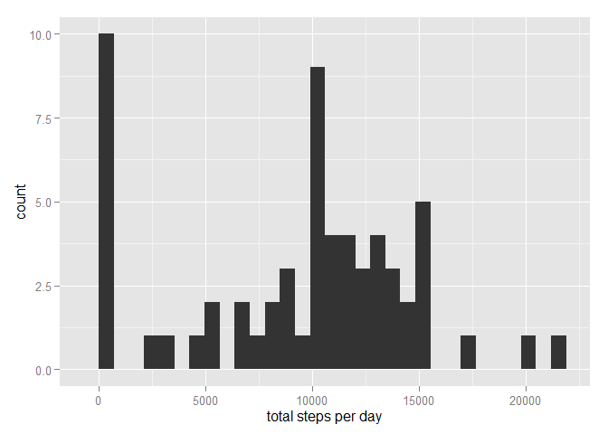
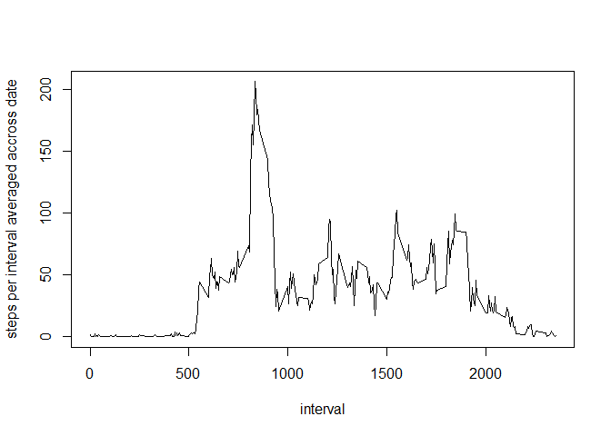
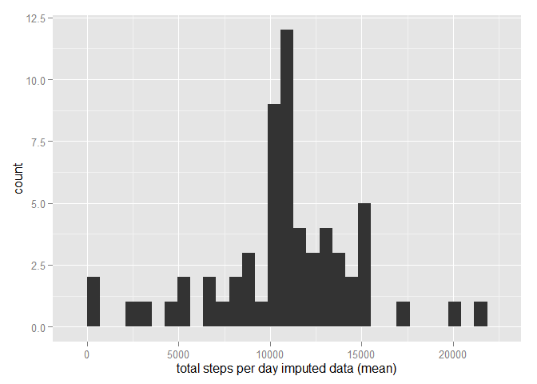
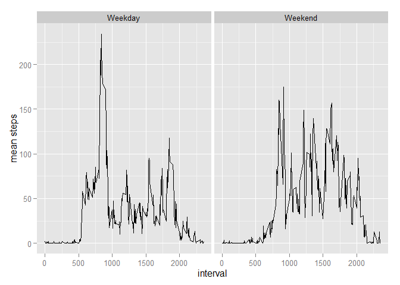

# Reproducible Research: Peer Assessment 1
Carlos Valle  
July 12, 2015  


## Loading and preprocessing the data

This chunk loads the data 
1. Calculates the total number of steps taken per day
2. Makes a histogram of the total number of steps taken each day
3. Calculates and reports the mean and median of the total number of steps taken per day


```r
 activity <- read.csv("activity.csv")
 totalsteps <- aggregate(activity$steps, by=list(date = activity$date), FUN=sum, na.rm=TRUE)
 library(ggplot2)
 qplot(x, data = totalsteps, xlab = "total steps per day")
```

```
## stat_bin: binwidth defaulted to range/30. Use 'binwidth = x' to adjust this.
```

 

```r
 mean(totalsteps$x)
```

```
## [1] 9354.23
```

```r
 median(totalsteps$x)
```

```
## [1] 10395
```

## What is mean total number of steps taken per day?


## What is the average daily activity pattern?

1. Makes a time series plot (i.e. type = "l" ) of the 5 minute interval (xaxis) and the average number of steps taken, averaged across all days (yaxis)

2. Displays the 5 minute interval that contains the maximum number of steps averaged accross all days.


```r
 meanstepsbyinterval <- aggregate(activity$steps, by=list(interval = activity$interval), FUN=mean, na.rm=TRUE)
 plot(meanstepsbyinterval, type = "l", ylab = "steps per interval averaged accross date")
```

 

```r
 meanstepsbyinterval[meanstepsbyinterval$x == max(meanstepsbyinterval$x), 1]
```

```
## [1] 835
```


## Imputing missing values

Imputing missing values


1. Calculates and reports the total number of missing values in the dataset (i.e. the total number of rows with NA s)
2. Devises a strategy for filling in all of the missing values in the dataset. The strategy does not need to be sophisticated. For example, you could use the mean/median for that day, or the mean for that 5minute interval, etc.
3. Creates a new dataset that is equal to the original dataset but with the missing data filled in.
4. Makes a histogram of the total number of steps taken each day and Calculate and report
the mean and median total number of steps taken per day. 

Do these values differ from the estimates from the first part of the assignment? 
[answer]Yes

What is the impact of imputing missing data on the estimates of the total daily number of steps?
[answer]The data us less skewed. Mean and median converge


```r
missing<- sum(is.na(activity$steps))
percentmissing <- missing/nrow(activity)
 
newactivity<- activity


for(i in seq_len(nrow(meanstepsbyinterval))) 
        {
        #current values for replacement
        mean<- meanstepsbyinterval[i, 2]
        inter<- meanstepsbyinterval[i, 1]
        #selects rows to replace
        nas<-is.na(activity[,1])
        currentint<-activity[,3] == inter
        repl<- nas * currentint
        repl<-as.logical(repl)
        
        #replace
        newactivity[repl,1] = mean
        }

totalsteps2 <- aggregate(newactivity$steps, by=list(date = newactivity$date), FUN=sum, na.rm=TRUE)

qplot(x, data = totalsteps2, xlab = "total steps per day imputed data (mean)")
```

```
## stat_bin: binwidth defaulted to range/30. Use 'binwidth = x' to adjust this.
```

 

```r
mean(totalsteps2$x)
```

```
## [1] 10766.19
```

```r
median(totalsteps2$x)
```

```
## [1] 10766.19
```


## Are there differences in activity patterns between weekdays and weekends?

For this part the weekdays() function may be of some help here. Use the dataset with the filledin missing values for this part.
1. Create a new factor variable in the dataset with two levels - "weekday" and "weekend" indicating whether a given date is a weekday or weekend day.
2. Make a panel plot containing a time series plot (i.e. type = "l" ) of the 5minute
interval (xaxis) and the average number of steps taken, averaged across all weekday days or weekend days (yaxis).

See the README file in the GitHub repository to see an example of what this plot should look like using simulated data.


```r
activity$date<- as.POSIXct(activity$date, format="%Y-%m-%d")

activity$weekday <- weekdays(activity$date)
activity$weekend <- gsub("Saturday", "Weekend", activity$weekday)
activity$weekend <- gsub("Sunday", "Weekend", activity$weekend)
activity$weekend <- gsub("Monday", "Weekday", activity$weekend)
activity$weekend <- gsub("Tuesday", "Weekday", activity$weekend)
activity$weekend <- gsub("Wednesday", "Weekday", activity$weekend)
activity$weekend <- gsub("Thursday", "Weekday", activity$weekend)
activity$weekend <- gsub("Friday", "Weekday", activity$weekend)
activity$weekend <- as.factor(activity$weekend)

meanstepsbyinterval2 <- aggregate(activity$steps, by=list(interval = activity$interval, weekend=activity$weekend), FUN=mean, na.rm=TRUE)

ggplot(meanstepsbyinterval2, aes(interval, x)) + geom_line() + facet_grid(. ~ weekend)+labs(y = "mean steps") 
```

 


